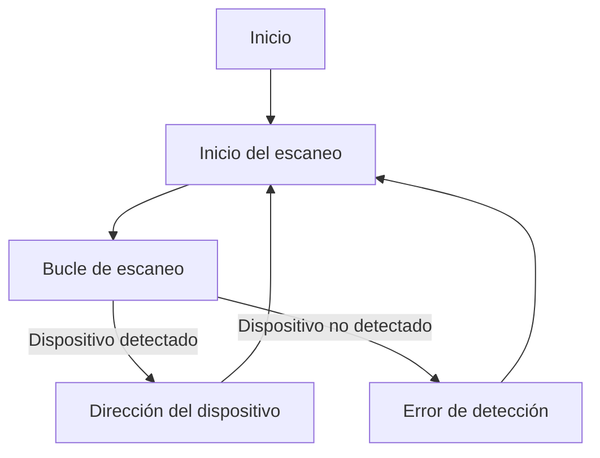
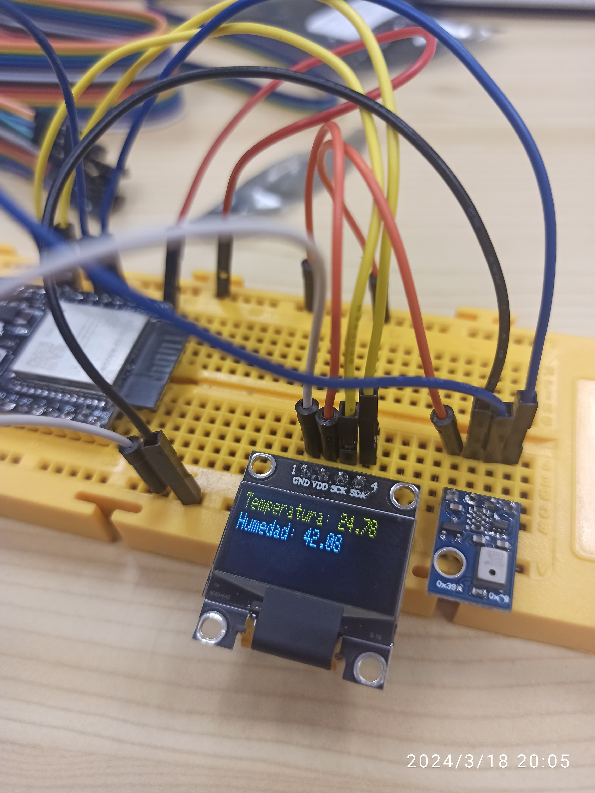
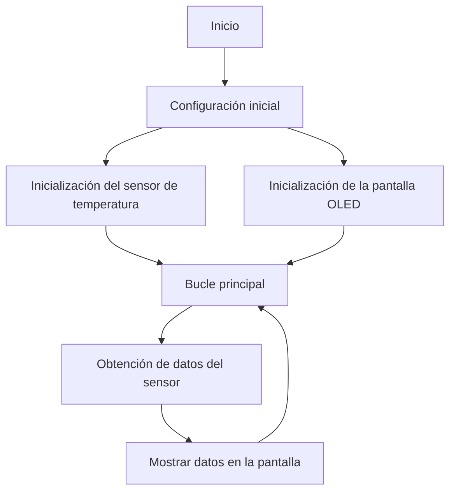

# Informe de la Práctica 5: Buses de comunicación I (introducción y I2c)

## Introducción

En esta práctica se exploran los buses de comunicación I2C, un protocolo de comunicación serial que permite la conexión de múltiples dispositivos a través de solo dos cables, facilitando la interconexión de componentes en sistemas electrónicos. Se abordarán dos ejercicios prácticos: en el primero se realizará un escaneo de dispositivos I2C para identificar sus direcciones, mientras que en el segundo se conectarán y comunicarán un sensor de temperatura y una pantalla OLED para mostrar los datos del sensor en la pantalla.

## Ejercicio Practico A: ESCÁNER I2C

### Código de la práctica A

El código proporcionado realiza un escaneo de dispositivos I2C y muestra las direcciones de los dispositivos detectados.

```cpp
#include <Arduino.h>
#include <Wire.h>
void setup()
{
  Wire.begin(5,6);
  Serial.begin(115200);
  while (!Serial); 
  Serial.println("\nI2C Scanner");
}
void loop()
{
  byte error, address;
  int nDevices;
  Serial.println("Scanning...");
  nDevices = 0;
  for(address = 1; address < 127; address++ ){
    // The i2c_scanner uses the return value of
    // the Write.endTransmisstion to see if
    // a device did acknowledge to the address.
    Wire.beginTransmission(address);
    error = Wire.endTransmission();
    if (error == 0){
      Serial.print("I2C device found at address 0x");
      if (address<16)
      Serial.print("0");
      Serial.print(address,HEX);
      Serial.println(" !");
      nDevices++;
    }
    else if (error==4){
      Serial.print("Unknown error at address 0x");
      if (address<16)
      Serial.print("0");
      Serial.println(address,HEX);
    }
  }
  if (nDevices == 0)
  Serial.println("No I2C devices found\n");
  else
  Serial.println("done\n");
  delay(5000); // wait 5 seconds for next scan
}
```
### Descripción de la salida por el Puerto Serie

El resultado del escaneo muestra las direcciones de los dispositivos I2C detectados.

```cpp
Scanning...
I2C device found at address 0x38 !
done
```

### Explicación del funcionamiento


El diagrama de flujo muestra el funcionamiento del escaneo de dispositivos I2C. Comienza con la inicialización y luego entra en un bucle donde se prueba cada dirección posible. Si se detecta un dispositivo en una dirección específica, se muestra su dirección; de lo contrario, se muestra un mensaje de error.

## Ejercicio Practico B: ESCÁNER I2C

### Código de la práctica B

Este código conecta un sensor de temperatura y una pantalla OLED para mostrar los datos del sensor en la pantalla.

```cpp
#include <Adafruit_AHTX0.h>
#include <Adafruit_GFX.h>
#include <Adafruit_SSD1306.h>
#include <Wire.h>

#define SCREEN_WIDTH 128 // Ancho de la pantalla OLED, en píxeles
#define SCREEN_HEIGHT 32 // Alto de la pantalla OLED, en píxeles

#define OLED_RESET -1 // Pin de reset (o -1 si se comparte el pin de reset del Arduino)
#define SCREEN_ADDRESS 0x3C ///< Ver la hoja de datos para la dirección; 0x3D para 128x64, 0x3C para 128x32

#define AHTX0_I2C_SCL 6
#define AHTX0_I2C_SDA 5

#define OLED_SDA 16
#define OLED_SCL 17

Adafruit_AHTX0 aht;
Adafruit_SSD1306 display(SCREEN_WIDTH, SCREEN_HEIGHT, &Wire1, OLED_RESET);

void setup() {
  Wire.begin(AHTX0_I2C_SDA, AHTX0_I2C_SCL);
  Wire1.begin(OLED_SDA, OLED_SCL);
  Serial.begin(115200);
  Serial.println("Adafruit AHT10/AHT20 demo!");

  if (!aht.begin()) {
    Serial.println("¡No se pudo encontrar el AHT! ¡Verifique la conexión!");
    while (1) delay(10);
  }
  Serial.println("AHT10 o AHT20 encontrado");

  if(!display.begin(SSD1306_SWITCHCAPVCC, SCREEN_ADDRESS)) {
    Serial.println(F("¡Error al asignar memoria para SSD1306!"));
    for(;;);
  }

  display.display();
  delay(2000);
  display.clearDisplay();
}

void loop() {
  sensors_event_t humidity, temp;
  aht.getEvent(&humidity, &temp); // Obtener los objetos de temperatura y humedad con datos actualizados

  display.clearDisplay();

  display.setTextSize(1);
  display.setTextColor(SSD1306_WHITE);
  display.setCursor(0, 0);
  display.print("Temperatura: ");
  display.println(temp.temperature);
  display.print("Humedad: ");
  display.println(humidity.relative_humidity);

  display.display();
  
  Serial.print("Temperatura: ");
  Serial.print(temp.temperature);
  Serial.println(" grados C");
  Serial.print("Humedad: ");
  Serial.print(humidity.relative_humidity);
  Serial.println("% HR");

  delay(500);
}

```
### Descripción del resultado




### Explicación del funcionamiento

